# Zelda RL-LLM System Architecture

## Overview
This system trains a reinforcement learning agent to play Zelda: Oracle of Seasons using multimodal LLM guidance on OpenShift AI (ROSA).

## Architecture Diagram

```mermaid
graph TB
    subgraph ROSA["🎯 OpenShift AI / ROSA Cluster"]
        subgraph llmd["📦 llm-d Namespace"]
            LLM1["🤖 Llama4Scout-17B<br/>Pod 1<br/>8x A100 GPUs<br/>Node: p4d-220"]
            LLM2["🤖 Llama4Scout-17B<br/>Pod 2<br/>8x A100 GPUs<br/>Node: p4d-190"]
            LLM3["🤖 Llama4Scout-17B<br/>Pod 3<br/>8x A100 GPUs<br/>Node: p4d-39"]
            Gateway["🌐 Inference Gateway<br/>llama4scout-service<br/>ClusterIP: 172.30.21.1<br/>Port: 8000"]
            
            LLM1 --> Gateway
            LLM2 --> Gateway
            LLM3 --> Gateway
        end
        
        subgraph minio["💾 minio-system Namespace"]
            MinIO["🗄️ MinIO S3<br/>ClusterIP: 172.30.45.38<br/>Port: 9000<br/>Bucket: zelda-rl-checkpoints"]
        end
        
        subgraph zelda["🎮 zelda-hybrid-rl-llm Namespace"]
            RayHead["☀️ Ray Head<br/>zelda-rl-head<br/>Job Coordinator<br/>Ray Callback"]
            RayWorker1["⚡ Ray Worker 1 ACTIVE<br/>6-12x Zelda Envs<br/>PyBoy + PPO + StateEncoder<br/>HUD Controller"]
            RayWorker2["⚡ Ray Worker 2-5<br/>6-12x Zelda Envs<br/>Total: 30-60 parallel envs<br/>Silent Training"]
            RayWorkerN["⚡ Ray Worker N<br/>Scalable: 5-50 workers<br/>CPU-optimized pods"]
            HUD["📊 Web HUD<br/>zelda-hud-service<br/>Port: 8086<br/>Single Session 10s timeout"]
            
            RayHead --> RayWorker1
            RayHead --> RayWorker2
            RayHead --> RayWorkerN
            RayHead ==>|Epoch, Global Stats<br/>Training Metrics<br/>ray_hud_callback.py| HUD
            RayWorker1 ==>|Screenshots Every 3 steps<br/>Game State, Episodes<br/>Single Active Session| HUD
            RayWorker2 -.->|Inactive<br/>Session in use| HUD
            RayWorkerN -.->|Silent Training<br/>No HUD access| HUD
        end
        
        Gateway ==>|Vision: 3% steps<br/>Text: 2% steps<br/>172.30.21.1:8000<br/>Direct IP| RayWorker1
        Gateway ==>|Probability-based<br/>LLM Guidance| RayWorker2
        Gateway ==>|Strategic Actions<br/>+5/+50 bonuses| RayWorkerN
        MinIO -.->|ROM Download<br/>Checkpoint Storage| RayWorker1
        MinIO -.->|Bundled in Job| RayWorker2
    end
    
    User["👤 User Browser"] -.->|http://hud:8086<br/>Real-time Dashboard| HUD
    
    style ROSA fill:#e1f5ff,stroke:#0277bd,stroke-width:4px,color:#000
    style llmd fill:#ffe0b2,stroke:#ef6c00,stroke-width:2px,color:#000
    style minio fill:#e1bee7,stroke:#7b1fa2,stroke-width:2px,color:#000
    style zelda fill:#c8e6c9,stroke:#2e7d32,stroke-width:2px,color:#000
    style Gateway fill:#29b6f6,stroke:#0277bd,stroke-width:2px,color:#000
    style MinIO fill:#ab47bc,stroke:#7b1fa2,stroke-width:2px,color:#fff
    style HUD fill:#66bb6a,stroke:#2e7d32,stroke-width:2px,color:#000
    style RayHead fill:#ffa726,stroke:#ef6c00,stroke-width:2px,color:#000
    style RayWorker1 fill:#43a047,stroke:#2e7d32,stroke-width:3px,color:#fff
    style RayWorker2 fill:#81c784,stroke:#2e7d32,stroke-width:2px,color:#000
    style RayWorkerN fill:#a5d6a7,stroke:#2e7d32,stroke-width:2px,color:#000
    style LLM1 fill:#5c6bc0,stroke:#3949ab,stroke-width:2px,color:#fff
    style LLM2 fill:#5c6bc0,stroke:#3949ab,stroke-width:2px,color:#fff
    style LLM3 fill:#5c6bc0,stroke:#3949ab,stroke-width:2px,color:#fff
```

## Component Details

### 🤖 LLM Inference Layer (llm-d namespace)

**Llama4Scout 17B Multimodal Models (3 replicas)**
- **Model**: RedHatAI/Llama-4-Scout-17B-16E-Instruct-FP8-dynamic
- **Each Pod**: 8x NVIDIA A100-SXM4-40GB GPUs
- **Total GPUs**: 24 GPUs across 3 P4d nodes
- **Configuration**:
  - GPU Memory Utilization: 95%
  - Max Context Length: 8192 tokens
  - Concurrent Sequences: 96 per pod (288 total)
  - Batch Tokens: 8192
  - Tensor Parallel Size: 8
  - Features: Chunked prefill, prefix caching, FP8 quantization
- **Performance**: ~2.2s latency for 50 tokens (~22 tokens/sec)

**Inference Gateway**
- **Service**: llama4scout-service
- **Type**: ClusterIP load balancer
- **ClusterIP**: 172.30.21.1 (accessed via direct IP, not DNS)
- **Port**: 8000
- **Function**: Distributes vision+text inference requests across 3 LLM pods
- **Connection**: Workers use direct IP `172.30.21.1:8000` to bypass cross-namespace DNS issues
- **Call Frequency**: 
  - Vision (with screenshot): 3% of steps (~1/33 steps)
  - Text-only (game state): 2% of steps (~1/50 steps)
  - Probability-based sampling (not fixed intervals)

### 🎮 RL Training Layer (zelda-hybrid-rl-llm namespace)

**Ray Cluster (zelda-rl)**
- **Head Node**: zelda-rl-head (job coordinator, Ray callback handler)
  - Manages worker pool and job submissions
  - Runs `ray_hud_callback.py` to send aggregate metrics to HUD
  - Sends: epoch (training_iteration), global_step, mean rewards
- **Workers**: Variable count (5-50 workers, configurable)
  - **Current**: 5 workers (optimal for LLM load management)
  - **Each Worker**: Runs 6-12 parallel Zelda environments
  - **Total Environments**: 30-60 parallel Game Boy emulators
  - **CPU-optimized**: High-performance CPU nodes
  - **Scalable**: Can scale to 50 workers (600 environments) for production
- **Status**: Ready, all workers available

**Ray Workers (Internal Components)**
Each worker pod runs:
- **PyBoy Emulator**: Headless Game Boy Color emulator
- **Zelda Environment**: `ZeldaRayEnv` (extends `ZeldaEnvConfigurable`)
- **State Encoder**: Extracts game state from RAM (`state_encoder.py`)
- **PPO Agent**: Proximal Policy Optimization controller
- **LLM Integration**: Probability-based LLM calls (2% text, 3% vision)
- **Reward System**: Movement-focused rewards (116x vs menu surfing)

**HUD Controller (Single-Session Model)**
- **Active Worker**: Only ONE worker sends to HUD at a time
- **Session Timeout**: 10 seconds (prevents session jumping)
- **Update Frequency**: Every 3 steps (~20 fps)
- **Data Sent**:
  - Screenshots (optimized: 160×144, 40% JPEG quality)
  - Game state (position, health, entities)
  - Episode metrics (steps, rewards)
  - Exploration stats (rooms, grid areas, milestones)
- **Failover**: If active worker crashes, another takes over after 10s

**Web HUD**
- **Service**: zelda-hud-service
- **Port**: 8086
- **Session Management**: Single active session, 10s timeout
- **Purpose**: Real-time dashboard showing:
  - Game screenshots (live gameplay)
  - LLM strategic suggestions (action + reasoning)
  - Training progress (epoch, episode, steps)
  - Reward metrics (total, alignment bonuses)
  - Game state (position, health, entities)
  - Exploration stats (rooms discovered, grid coverage)
  - Performance analytics (LLM success rate, response times)

## Data Flow

### 1. **Training Loop** (Every Step)
- **Ray Workers** execute PPO controller in parallel Zelda environments
- **PyBoy Emulator** runs Game Boy ROM (Zelda: Oracle of Seasons)
- **State Encoder** extracts game state from RAM (position, health, entities)
- **PPO Agent** selects action based on policy
- **Reward System** calculates rewards:
  - Movement: +0.1 per step
  - New room: +20.0 per discovery
  - Grid exploration: +5.0 per new square
  - Menu penalty: -0.5 per START press
  - Position stuck: -1.0 per step when stuck
  - Death: -50.0 per death

### 2. **LLM Guidance** (Probability-Based)
- **Text-only calls** (2% of steps):
  - Worker sends game state JSON to `172.30.21.1:8000`
  - Gateway load-balances to one of 3 Llama4Scout pods
  - LLM returns tactical suggestion (e.g., "UP", "LEFT")
  - Timeout: 15 seconds
- **Vision calls** (3% of steps):
  - Worker sends screenshot (320×288, 75% JPEG) + game state
  - Gateway load-balances to LLM pod
  - LLM analyzes visual context and returns strategic command
  - Timeout: 60 seconds
- **LLM Response**:
  - Returns: `{action: "UP", scene: "Link in grassy field..."}`
  - Stored as `last_llm_suggestion` for comparison

### 3. **Reward Shaping** (Alignment Bonuses)
- **PPO selects action** → compare with `last_llm_suggestion`
- **If match**:
  - Text alignment: +5.0 bonus
  - Vision alignment: +50.0 bonus (10x text - vision is gold standard!)
- **If mismatch**: No bonus (PPO explores independently)
- **Model learns**: Actions aligned with LLM get higher rewards

### 4. **HUD Monitoring** (Dual Data Sources)
**Source 1: Ray Callback (on Head)**
- **Frequency**: Every training iteration (~30-60 seconds)
- **Data**: Epoch (training_iteration), global_step, mean rewards
- **File**: `ray_hud_callback.py`
- **Purpose**: Aggregate training metrics

**Source 2: Active Worker (Worker 1)**
- **Frequency**: Every 3 steps (~20 fps at 60 steps/sec)
- **Data**: Screenshots, game state, episode metrics, exploration stats
- **Session**: Single active session (10s timeout)
- **Purpose**: Real-time gameplay visualization

**HUD Display**:
- **Epoch**: From callback (Ray training_iteration)
- **Episode**: From worker (worker-specific episode count)
- **Screenshots**: From worker (optimized 160×144, 40% JPEG)
- **Metrics**: Merged from both sources
- **Access**: User browser at `http://hud:8086`

### 💾 Storage Layer (minio-system namespace)

**MinIO S3**
- **Service**: MinIO object storage
- **ClusterIP**: 172.30.45.38:9000
- **Bucket**: zelda-rl-checkpoints
- **Purpose**: 
  - ROM file storage (Zelda: Oracle of Seasons)
  - Model checkpoint storage
  - Training results and logs
- **Access**: Workers use direct IP (bundled ROMs as fallback)
- **Credentials**: S3-compatible access/secret keys

## Hardware Topology

### P4d Nodes (GPU)
- **3x p4d.24xlarge nodes** (8x A100 GPUs each)
- One LLM pod pinned per node via pod anti-affinity
- 95% GPU memory utilization per pod

### CPU Nodes
- Ray head + workers on CPU-optimized nodes
- Training orchestration and environment simulation
- Scalable: 5-50 workers depending on LLM load

## Key Features

- **Horizontal Scaling**: 3 LLM replicas for high availability
- **Aggressive Optimization**: 4.5x faster inference than baseline
- **Load Balancing**: Automatic distribution across LLM pods
- **Real-time Monitoring**: Live HUD for training visualization
- **GPU Efficiency**: 24 GPUs fully utilized (100% allocation)

## Deployment

All Kubernetes manifests are located in `/k8s` directory:
- `llama4scout-deployment.yaml` - LLM deployment (3 replicas)
- `llama4scout-service.yaml` - Load balancer service
- `llama4scout-serviceaccount.yaml` - RBAC configuration

## Recent System Improvements (October 2025)

### 🔧 Critical Fixes Applied

**1. LLM Connection Issue (Priority 2)**
- **Problem**: 25,000+ connection failures due to DNS resolution
- **Solution**: Use direct service IP `172.30.21.1:8000` instead of DNS name
- **Impact**: 0% → >95% expected LLM success rate

**2. Entity Detection (Priority 3)**
- **Problem**: Always reported 0 NPCs, 0 enemies, 0 items
- **Solution**: Implemented hybrid detection (count addresses + type checking)
- **Addresses**: 0xCC30 (enemies), 0xCC31 (NPCs), 0xCC32 (items), 0xD140-0xD1FF (entity slots)
- **Impact**: LLM now receives real entity context

**3. Extreme Exploration Emphasis (Priority 5)**
- **Problem**: Agent stuck in 7-8 rooms over 9.5 hours, menu surfing behavior
- **Solution**: Massive reward restructuring
  - Room discovery: 5.0 → 20.0 (+300%)
  - Movement: 0.02 → 0.1 (+400%)
  - Grid exploration: NEW! +5.0 per square
  - Menu penalty: NEW! -0.5 per START press
  - Position stuck: NEW! -1.0 per step
  - Death: -3.0 → -50.0 (+1567%)
- **Impact**: Movement 116x more rewarding than menu surfing

**4. HUD Session Management**
- **Problem**: Multiple workers causing session jumping (0.5s handoffs)
- **Solution**: 
  - Increased timeout: 0.5s → 10.0s
  - Disabled aggressive retry in workers
  - Single stable session model
- **Impact**: Smooth, consistent HUD updates from one source

**5. HUD Data Streaming**
- **Problem**: Only screenshots showing, no training metrics
- **Solution**: Decoupled training data from screenshot capture
- **Impact**: All metrics update every 3 steps (episode, steps, rewards, entities)

**6. HUD Epoch Display**
- **Problem**: Random/0 values for epoch
- **Solution**: Workers don't send epoch, callback handles it
- **Impact**: Epoch shows real Ray training_iteration

### 📊 Configuration Updates

**Current Optimal Settings:**
- **Workers**: 5 (scalable to 50)
- **Envs per worker**: 6-12
- **Total environments**: 30-60 parallel
- **LLM text calls**: 2% probability
- **LLM vision calls**: 3% probability
- **HUD update frequency**: Every 3 steps
- **Session timeout**: 10 seconds
- **Batch size**: 4096

### 📚 Documentation Added

- `CLUSTER_TRAINING_ANALYSIS.md` - 40+ hour training log analysis
- `LLM_CONFIGURATION_GUIDE.md` - Local MLX vs Cluster vLLM setup
- `LLM_CONNECTION_FIX.md` - DNS issue resolution guide
- `ENTITY_DETECTION_RESEARCH.md` - Entity memory architecture research

### 🎯 Expected Performance

After fixes:
- **LLM Success Rate**: >95% (was 0%)
- **Rooms Explored**: 100+ per episode (was 7-8 in 9.5 hours)
- **Entity Detection**: Real counts (was always 0)
- **Agent Behavior**: Aggressive exploration (was menu surfing)
- **HUD Updates**: All metrics streaming smoothly
